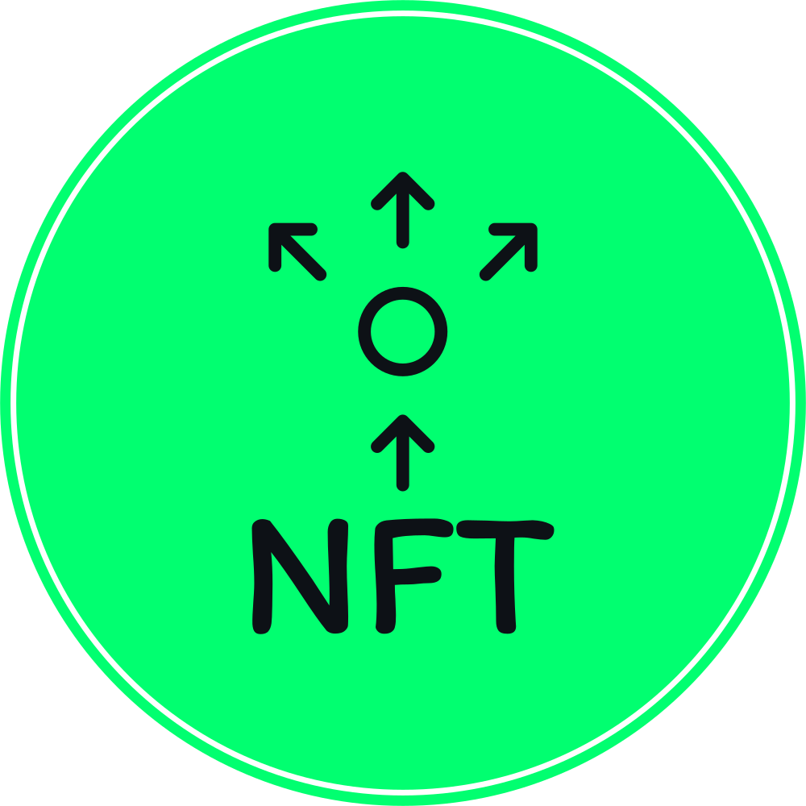
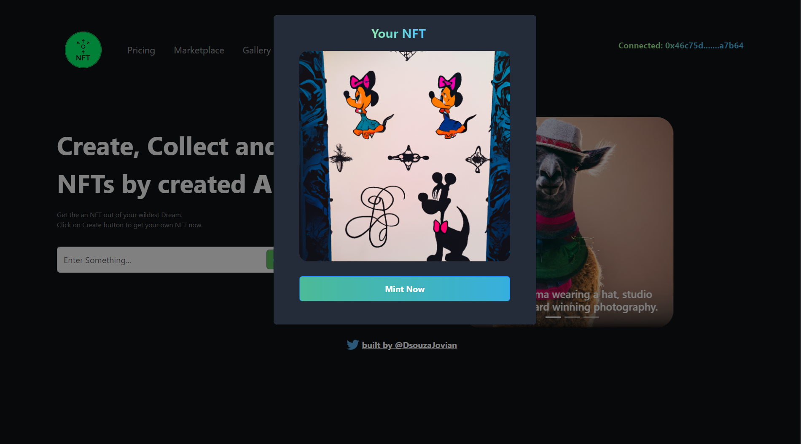
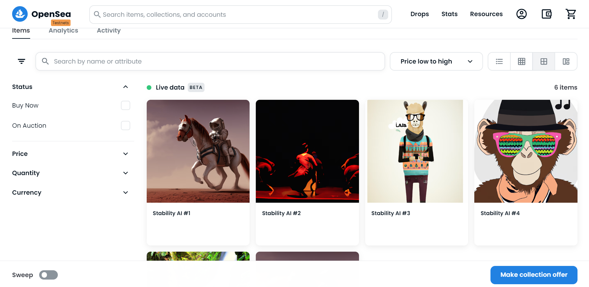

## AI NFT

<!-- PROJECT LOGO -->
<br />
<div align="center">
  <a href="https://github.com/Jovian-Dsouza/AI-nft">
    
  </a>

  <h3 align="center">AI NFT</h3>

  <p align="center">
    A website to mint NFT using generative AI
    <br />
    <a href="https://ainft.joviandsouza.repl.co/">View Demo</a>
    ·
    <a href="https://github.com/Jovian-Dsouza/AI-nft/issues">Report Bug</a>
    ·
    <a href="https://github.com/Jovian-Dsouza/AI-nft/issues">Request Feature</a>
  </p>
</div>


<!-- ABOUT THE PROJECT -->
## About The Project

[](https://ainft.joviandsouza.repl.co/)
[](https://testnets.opensea.io/collection/stablediffusionnft-bqmipytzf0)

AI-NFT is an ERC721 based NFT Contract currently deployed on the Ethereum Goerli test network. This project is for learning purposes only. ERC-721 tokens are the standards for non-fungible tokens (NFTs). These tokens cannot be exchanged for anything of equal value since they are unique in themselves, representing a unique asset. Each NFT token is linked to different owners and has its own tokenID. This projects creates an NFT from Text-to-Image AI and allows your to mint and trade it on the [OpenSea](https://opensea.io/) platform.


Here are some cool features of this project:

* Use AI to generate NFTs using text-to-image models such as [DALL-E](https://openai.com/blog/dall-e/), [stable-diffusion](https://huggingface.co/spaces/stabilityai/stable-diffusion)
* Based on ERC721 Contract
* Deployed NFT is OpenSea compatible, allowing users to show off and trade their NFTs

Live project Demo : [Click Here](https://ainft.joviandsouza.repl.co/)
Minted NFTs on OpenSea : [Click Here](https://testnets.opensea.io/collection/stablediffusionnft-bqmipytzf0) 

<p align="right">(<a href="#readme-top">back to top</a>)</p>

### Built With

* React
* Express
* Bootstrap
* Ether.js
* Solidity
* Hardhat
* Openzeppelin


<p align="right">(<a href="#readme-top">back to top</a>)</p>


### Setting up

```bash
git clone https://github.com/Jovian-Dsouza/AI-nft
cd AI-nft
npm install
```

Create a `.env` file in the root folder of project containing the following
```
REACT_CONTRACT_ADDRESS=.....
REACT_APP_BASE_URL="http://localhost:3000"

OPENAI_API_KEY=.....
PINATA_API_KEY=.....
PINATA_API_SECRET=.....

QUICKNODE_API_KEY_URL=.....
GOERLI_PRIVATE_KEY=.....

```

Start sever
```bash
npm run start:production

## OR
npm run start:dev
```

<p align="right">(<a href="#readme-top">back to top</a>)</p>

<!-- CONTRIBUTING -->
## Contributing

Contributions are what make the open source community such an amazing place to learn, inspire, and create. Any contributions you make are **greatly appreciated**.

If you have a suggestion that would make this better, please fork the repo and create a pull request. You can also simply open an issue with the tag "enhancement".
Don't forget to give the project a star! Thanks again!

1. Fork the Project
2. Create your Feature Branch (`git checkout -b feature/AmazingFeature`)
3. Commit your Changes (`git commit -m 'Add some AmazingFeature'`)
4. Push to the Branch (`git push origin feature/AmazingFeature`)
5. Open a Pull Request

<p align="right">(<a href="#readme-top">back to top</a>)</p>


<!-- LICENSE -->
## License

Distributed under the MIT License.

<p align="right">(<a href="#readme-top">back to top</a>)</p>


<!-- CONTACT -->
## Contact

Your Name - [@DsouzaJovian](https://twitter.com/DsouzaJovian) - dsouzajovian123@gmail.com

Project Link: [https://github.com/Jovian-Dsouza/AI-nft](https://github.com/Jovian-Dsouza/AI-nft)

<p align="right">(<a href="#readme-top">back to top</a>)</p>
